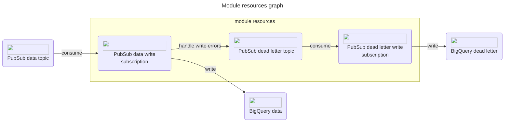

# PubSub

```mermaid
---
title: Module resources graph
---
graph LR

    ps_topic_data(<img src='https://icons.terrastruct.com/gcp%2FProducts%20and%20services%2FData%20Analytics%2FCloud%20PubSub.svg' width='32' height='32' /> PubSub data topic)

    bq_table_data(<img src='https://icons.terrastruct.com/gcp%2FProducts%20and%20services%2FData%20Analytics%2FBigQuery.svg' width='32' height='32' /> BigQuery data)

    bq_table_dl(<img src='https://icons.terrastruct.com/gcp%2FProducts%20and%20services%2FData%20Analytics%2FBigQuery.svg' width='32' height='32' /> BigQuery dead letter)


    subgraph ps_write_subscription_module[module resources]
        ps_topic_dl(<img src='https://icons.terrastruct.com/gcp%2FProducts%20and%20services%2FData%20Analytics%2FCloud%20PubSub.svg' width='32' height='32' /> PubSub dead letter topic)

        ps_sub_data(<img src='https://icons.terrastruct.com/gcp%2FProducts%20and%20services%2FData%20Analytics%2FCloud%20PubSub.svg' width='32' height='32' /> PubSub data write subscription)

        ps_sub_dl(<img src='https://icons.terrastruct.com/gcp%2FProducts%20and%20services%2FData%20Analytics%2FCloud%20PubSub.svg' width='32' height='32' /> PubSub dead letter write subscription)
    end

    ps_topic_data-- consume -->ps_sub_data
    ps_sub_data-- write -->bq_table_data
    ps_sub_data-- handle write errors -->ps_topic_dl
    ps_topic_dl-- consume -->ps_sub_dl
    ps_sub_dl-- write-->bq_table_dl

```
